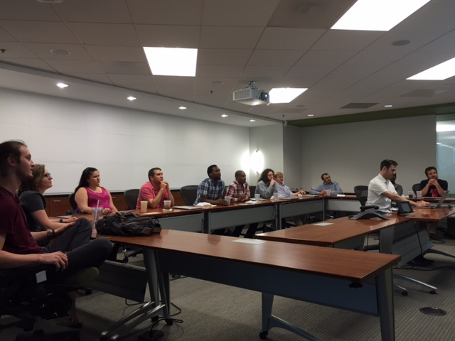

This past Thursday I had the opportunity to learn about mob programming. Mob programming is the concept of having an entire group (four or more) or team developers writing code together with only one computer, one keyboard, and one task to accomplish. The mob designates a ‘driver,’ who simply writes down the code the mob decides is appropriate. The group also moves at the speed of the mob, with the intention that no one is left behind.

It looks a little like this:

## How does it work?

My colleague, Paul, put on an hour long mob programming session with the intent of creating a hexadecimal calculator, which would take in an integer and provide the hexadecimal value as output. 

We started by picking a driver, who would sit at the computer and listen to the group (we ended up switching out the driver every 10 minutes since we only had about 40 minutes to finish the task). The rest of us, picked a language to code in. We decided on Ruby on Rails, although we had some developers who mainly coded in Java or Javascript. Then, we started talking about what we needed to do.

First we started with the view by creating a form. Since some of the developers did not have experience with Rails, not everyone was sure how to proceed. This resulted in Rails developers talking mostly at first, but other developers from other languages also engaged. It was surprisingly difficult to create a form as a group--especially when I so rarely it from scratch. What I found most interesting is how, although it took longer to complete the form, developers who had no experience with Ruby on Rails started to pick up on how to program using it.

We then worked on creating the controller, using Ruby methods in our implementation of the calculator. We went through this relatively briefly, although we went through a view iterations of it, improving it within a short period of time.

Then, we were done!

## Why Mob Programming?

Now, you may be thinking:

And I get it. I didn’t really know how this would work. I was dubious, and I still don’t know if I like the idea or not. It is interesting as concept and a novel experience.

There are some advantages to completing a task using mob programming, especially a large task. For one, knowledge sharing--the whole team gets to give input and understands the code. As my colleague Paul pointed out, it's easy to look at pull requests and 'get' someone's code, but not necessarily the thought process behind it. Rather, it takes working with the code to really understand it. This problem is addressed using mob programming. Per Jansson notes in his [blog post](https://thecuriousdeveloper.com/2013/09/15/get-a-good-start-with-mob-programming/) that his team tried it to tackle a big epic; not only were they able to spread knowledge, but the team was able to take ownership of the problem and solution and better understand them both moving forward. (For more benefits and details of his experience using mob programming, I recommend reading his blog post in full.)

## Final thoughts

I really like pair programming and see the immense value in consistently practicing it. I think, too, that mob programming can play a valuable role on a team. I'm curious, though, as to the extent of sucess a team would experience using this method. I also have other questions:

* What are the components that make it successful? 

* What mob size is best? 

* Does that change depending on the problem being solved? 

* What happens when the team is top-heavy or has many juniors?

* When is it more productive to break off into pair programming?

I have some toughts on some of these questions. I would hypothesize that the size of the group couldn’t get too big–perhaps between 4-6 people. Additionally (and this may be a no-brainer), the mob would need to have people who value the process, including the learning process for juniors as well as developers not familiar with a language. It also seems clear that the mob would, as a whole, need to be engaged. 

I'm excited to share this with you all. I'm also excited to gain more experience with this practice--so expect another post in the future!

Happy Sunday, friends! :) 

